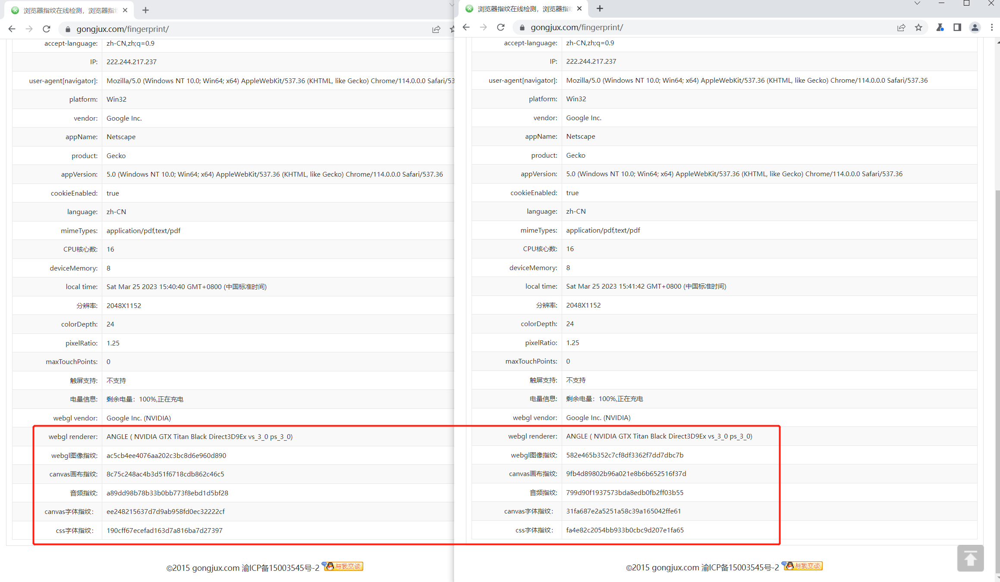

- # r0chrome
    - `r0chrome`是一款对chromium源码进行定制的浏览器,支持爬虫/JS逆向工程师进行辅助分析网页
    - ## 浏览器随机指纹模块
        - ### 实现功能：
        ```
        gpu信息随机
        webgl图像指纹随机
        canvas画布指纹随机
        音频指纹随机随机
        canvas字体指纹随机
        css字体指纹随机
        ```
        - #### 效果
            
            - 测试网站 
                - https://gongjux.com/fingerprint/
        - #### 源码
            - 修改的源代码在change_code文件夹下
            - 修改的代码上面有`// add `的注释
        - #### 安装包
            - Win版本
                - http://www.dtasecurity.cn:20080/chrome.win.7z
                - 安装方法：
                    - 使用7z解压文件，在文件夹下打开chrome.exe即可使用
            - Linux版本
                - http://www.dtasecurity.cn:20080/chromium-browser-unstable_103.0.5045.0-1_amd64.deb
                - 安装方法
                    - 在ubuntu命令行中输入 
                        - sudo dpkg -i chromium-browser-unstable_103.0.5045.0-1_amd64.deb
                    - 然后在软件中或者命令行下即可打开浏览器
    - ## 浏览器环境自吐模块
        - ### 开发中即将上线
- # 联系我们
    - #### 加v：r0ysue 进浏览器指纹随机定制群
- #### 后续会推出其他定制浏览器的功能
